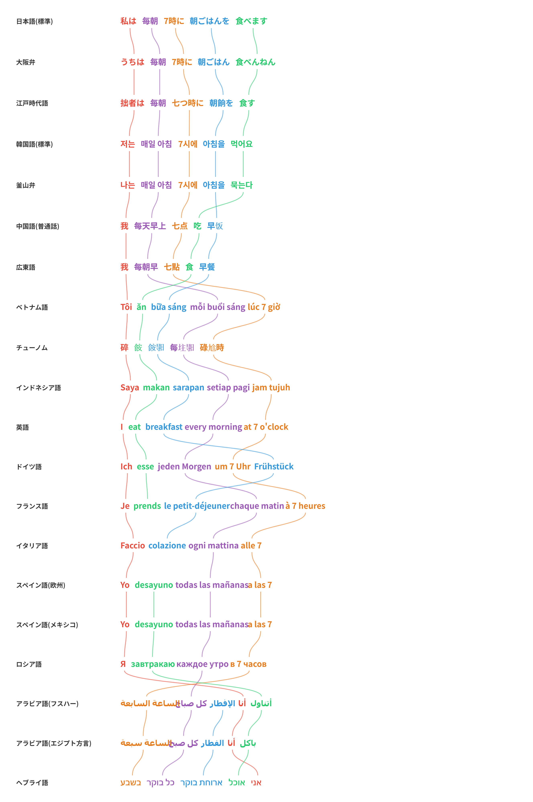

# LangMap - Multilingual Word Order Map



**LangMap** is an interactive web tool that visualizes how word order differs across languages. Each sentence is broken into color-coded semantic segments, and curved lines connect corresponding segments between languages — making it instantly clear how languages rearrange the same meaning.

Inspired by [sunjun_kim's language mapping graphic](https://twitter.com/sunjun_kim).

**Live site:** [langmap.heuron.com](https://langmap.heuron.com)  
**GitHub:** [github.com/jounlai/langmap](https://github.com/jounlai/langmap)

## Features

- **100 sample sentences** across 226 languages/dialects with hand-aligned semantic segments
- **226 languages** including dialects, historical variants, and creoles (see below)
- **Toggle languages ON/OFF** — show only the languages you want to compare
- **Drag-to-reorder** — reorder languages both from the control panel and directly in the map display
- **Color-coded segments** with SVG bezier curves connecting corresponding parts
- **URL state persistence** — every setting (sentence, languages, order, UI language) is saved in the URL hash for sharing and bookmarking
- **UI in 21 languages** — switch the entire interface language from the top-right selector
- **RTL support** — Arabic, Hebrew, and Persian render right-to-left
- **Export** — save as PNG or SVG
- **Share** — copy URL, share to X (Twitter), Facebook, LINE
- **Keyboard shortcuts** — `←`/`→` to navigate sentences, `r` for random
- **Inline editing** — click any segment to edit translations directly in the map
- **Copy text** — copy any language row's text with one click
- **[Word Map](wordmap.html)** — interactive world map showing 20 key words in 874 languages (incl. Russian Far East / Siberian indigenous, Sinitic varieties & East/SE Asian dialects, Indo-Aryan & Tibeto-Burman, Bantu & West African, Nilotic & Cushitic, Berber, Mesoamerican & Andean indigenous, Caucasian, Pacific & Australian Aboriginal, Indonesian & Philippine regional, ancient Asian: Old Chinese, Old Japanese, Vedic Sanskrit, Tangut, Sogdian, Old Turkic, Khitan, Jurchen, Old Mon, Pyu, Old Burmese, Old Cham, Old East Slavic, Scythian, Old Thai (Sukhothai), Meroitic, Old Nubian, Classical Quechua, Mochica, Chibcha, Old Malay, Old Sundanese, Old Tagalog) with pronunciation guides (IPA / broad transcription / romanization, Chao tone letters where applicable), 2D/3D globe toggle, language info panel, full i18n (panel labels, language descriptions, speaker annotations, typology row, badges, ARIA labels, ON/OFF toggles, Compare panel — all 18+ UI languages), drag-to-reorder language comparison view, and a **fully multilingual linguistic filter panel** for family / script / word order / tonal / morphology / speaker tier — era-aware chip counts, 0-count chips disabled, selections persist in the URL
- **[Family Tree](tree.html)** — D3-based horizontal dendrogram of all Word Map languages organized by genealogical family, with curved Bezier branches and family-name i18n; click a leaf to jump to the language on the Word Map

## Languages (226 total, ordered by similarity)

> Entries marked with `*` are registered but pending sentence data (can't be toggled on in the UI yet).

| Group | Languages | Codes |
|---|---|---|
| Japanese | Standard, Kyoto, Osaka, Hiroshima, Hakata, Aomori, Okinawan, Miyako, Yaeyama, Edo-period, Heian-period | `ja`, `ja_kyo`, `ja_osa`, `ja_hir`, `ja_hak`, `ja_aom`, `ja_oki`, `ja_mvi`, `ja_rys`, `ja_edo`, `ja_heian` |
| Ainu | Ainu | `ain` |
| Korean | Standard, North Korean, Busan, Jeju, Yanbian, Early Modern, Middle Korean | `ko`, `ko_kp`, `ko_bus`, `ko_jeju`, `ko_yb`, `ko_em`, `ko_mid` |
| Mongolic | Mongolian, Inner Mongolian | `mn`, `mn_cn` |
| Turkic | Turkish, Uyghur, Kazakh, Uzbek, Azerbaijani, Kyrgyz, Turkmen | `tr`, `ug`, `kk`, `uz`, `az`, `ky`, `tk` |
| Chinese | Mandarin, Dongbei, Sichuan, Cantonese, Taiwanese, Shanghainese, Hakka, Min Dong, Han Classical, Tang Classical, Song-Ming Classical | `zh`, `zh_db`, `zh_sc`, `yue`, `nan`, `wuu`, `hak_cn`, `cdo`, `zh_han`, `zh_tang`, `zh_song` |
| Tibeto-Burman | Tibetan, Burmese, Yi (Nuosu) | `bo`, `my`, `ii` |
| Hmong-Mien | Hmong (Miao) | `hmn` |
| Southeast Asian | Vietnamese, Vietnamese (Central), Vietnamese (Southern), Chữ Nôm, Khmer, Thai, Thai (Northern/Southern/Isan), Lao, Indonesian, Sundanese, Malay, Javanese, Tagalog, Cebuano, Ilocano, Zhuang | `vi`, `vi_c`, `vi_s`, `vi_nom`, `km`, `th`, `th_n`, `th_s`, `th_isan`, `lo`, `id`, `su`, `ms`, `jv`, `tl`, `ceb`, `ilo`, `za` |
| Austronesian (Oceanic) | Malagasy, Maori, Hawaiian, Fijian, Samoan, Tongan*, Palauan | `mg`, `mi`, `haw`, `fj`, `sm`, `to`, `pau` |
| South Asian | Sanskrit, Pali, Hindi, Urdu, Punjabi, Sindhi, Bengali, Assamese, Odia, Bhojpuri, Nepali, Marathi, Gujarati, Sinhala, Romani, Tamil, Telugu, Kannada, Malayalam | `sa`, `pi`, `hi`, `ur`, `pa`, `sd`, `bn`, `as`, `or`, `bho`, `ne`, `mr`, `gu`, `si`, `rom`, `ta`, `te`, `kn`, `ml` |
| Iranian | Persian, Tajik, Kurdish (Kurmanji), Kurdish (Sorani), Pashto | `fa`, `tg`, `ku`, `ckb`, `ps` |
| Semitic & Ancient Near East | Arabic (MSA, Egyptian, Levantine, Gulf, Iraqi, Moroccan, Tunisian, Sudanese), Hebrew, Aramaic, Akkadian, Amharic, Tigrinya, Maltese, Ancient Egyptian, Coptic, Sumerian | `ar`, `ar_eg`, `ar_lev`, `ar_gulf`, `ar_iq`, `ar_ma`, `ar_tn`, `ar_sd`, `he`, `arc`, `akk`, `am`, `ti`, `mt`, `egy`, `cop`, `sux` |
| African | Swahili, Lingala, Shona, Zulu, Xhosa, Yoruba, Igbo, Hausa, Wolof, Somali, Oromo, Kinyarwanda, Chichewa, Afrikaans | `sw`, `ln`, `sn`, `zu`, `xh`, `yo`, `ig`, `ha`, `wo`, `so`, `om`, `rw`, `ny`, `af` |
| Proto-Indo-European | Proto-Indo-European, Hittite | `ine`, `hit` |
| Germanic | English, English dialects (AAVE/Southern/Appalachian/Australian/Indian/Irish/Scots/Yorkshire/Cockney/Singaporean), Scots, Dutch, Frisian, German, Swiss German, Austrian German, Bavarian, Low German, Yiddish, Swedish, Norwegian (Bokmål/Nynorsk), Danish, Icelandic, Faroese, Middle English, Old English, Old Norse, Gothic | `en`, `en_aave`, `en_south`, `en_app`, `en_au`, `en_in`, `en_ie`, `en_sco`, `en_yk`, `en_ck`, `en_sg`, `sco`, `nl`, `fy`, `de`, `de_gsw`, `de_at`, `de_by`, `nds`, `yi`, `sv`, `no`, `nn`, `da`, `is`, `fo`, `enm`, `en_ang`, `non`, `got` |
| Celtic | Irish, Scottish Gaelic*, Welsh, Breton | `ga`, `gd`, `cy`, `br` |
| Romance | Latin, Italian, Venetian, Neapolitan, Sicilian, Sardinian, French, French (Quebec/African/Belgian/Swiss), Occitan, Catalan, Spanish (EU/MX/CO/CL/AR/Cuban/Peruvian/Andalusian), Ladino, Galician, Romansh, Portuguese (EU/BR), Romanian, Old Church Slavonic | `la`, `it`, `vec`, `nap`, `scn`, `sc`, `fr`, `fr_qc`, `fr_af`, `fr_be`, `fr_ch`, `oc`, `ca`, `es_eu`, `es_mx`, `es_co`, `es_cl`, `es_ar`, `es_cu`, `es_pe`, `es_an`, `lad`, `gl`, `rm`, `pt_eu`, `pt_br`, `ro`, `cu` |
| Slavic | Russian, Ukrainian, Belarusian, Polish, Czech, Slovak, Slovenian, Serbian, Bulgarian | `ru`, `uk`, `be`, `pl`, `cs`, `sk`, `sl`, `sr`, `bg` |
| Baltic | Lithuanian, Latvian | `lt`, `lv` |
| Hellenic | Greek, Ancient Greek | `el`, `el_grc` |
| Albanian | Albanian | `sq` |
| Armenian | Armenian | `hy` |
| Uralic | Finnish, Estonian, Northern Sami*, Hungarian | `fi`, `et`, `se`, `hu` |
| Basque | Basque | `eu` |
| Kartvelian | Georgian | `ka` |
| Indigenous Americas | Navajo, Quechua, Guarani, Inuktitut, Cherokee, Classical Nahuatl, Classical Maya | `nv`, `qu`, `gn`, `iu`, `chr`, `nci`, `myn` |
| Creoles & Pidgins | Hawaiian Creole, Nigerian Pidgin, Tok Pisin, Haitian Creole, Jamaican Patois, Papiamento | `hwc`, `pcm`, `tpi`, `ht`, `jam`, `pap` |
| Constructed | Esperanto, Toki Pona, Lojban, Klingon | `eo`, `tok`, `jbo`, `tlh` |
| Tungusic | Manchu | `mnc` |

## Getting Started

No build step required. Just serve the files with any static HTTP server:

```bash
# Python
python3 -m http.server 8080

# Node.js
npx serve .

# Or simply open index.html in a browser
```

Then open `http://localhost:8080`.

## URL Parameters

State is stored in the URL hash for sharing:

| Parameter | Description | Example |
|---|---|---|
| `s` | Sentence index (0-99) | `s=5` |
| `l` | Enabled language codes (comma-separated) | `l=ja,ko,en,de` |
| `o` | Language display order | `o=en,ja,ko,zh` |
| `ui` | UI language code | `ui=en` |

Example: `#s=0&l=ja,en,zh,ar&ui=en`

## File Structure

```
langmap/
  index.html              — Main HTML page (Word Order Map)
  wordmap.html            — Word Map page (20 words × 874 languages on a world map)
  tree.html               — Language Family Tree page (D3 horizontal dendrogram)
  wordmap_data.js         — Word Map core data (words, IPA, coordinates, native names, UI strings)
  wordmap_meta.js         — Word Map metadata (per-language family/speakers/script + multilingual descriptions); lazy-loaded on first modal open
  styles.css              — Styles (including RTL support)
  app.js                  — Rendering engine, controls, drag-and-drop, export, i18n
  data.js                 — 100 sentences × 226 languages with segment alignments
  lang_names.js           — Word Map language display names (per UI language)
  meta_i18n_ext.js        — Word Map metadata translation atoms (per-UI-lang base dictionaries + recursive composer translateMetaSmart)
  meta_i18n_coverage.js   — Layered patches that extend META_I18N_ATOMS / META_I18N for full UI-lang coverage of compound meta phrases (countries, families, scripts, romanization standards, region compounds…) without rewriting the base atoms
  lang-filter.js          — Word Map typology filter (word order / tone / morphology / family / script / speaker tier)
  validate_data.py        — Sentence/Word-Order Map validator (data.js)
  validate_wordmap_data.js — Word Map validator (wordmap_data.js + wordmap_meta.js + lang_names.js)
  CONTRIBUTING.md         — Data contribution guidelines
```

## Data Format

Each sentence in `data.js` follows this structure:

```javascript
{
  id: 1,
  title: "English description",
  segments: {
    A: { color: "#e74c3c" },  // semantic role
    B: { color: "#3498db" },
    ...
  },
  langs: {
    ja: [["A","私は"], ["B","ホテルの向かいの"], ...],  // Japanese word order
    en: [["A","I"], ["F","want to try on"], ...],       // English word order
    ar: [["F","أريد أن أجرب"], ["E","البدلة"], ...],    // Arabic word order (VSO)
    ...
  }
}
```

Each language lists the same segment IDs in its own natural word order. The visualization draws colored lines between matching segments to show how order differs.

## Contributing

See [CONTRIBUTING.md](CONTRIBUTING.md) for guidelines on adding sentences or languages.

### Sentence / Word Order Map validation

Run `python3 validate_data.py` to check `data.js` and the sentence segmentation/order map.

### Word Map validation

Run `node validate_wordmap_data.js` to check `wordmap_data.js`, `wordmap_meta.js`, `lang_names.js`, historical-language status, word-entry shape, metadata, i18n coverage, and Word Map-specific invariants.

If you changed Word Map files (`wordmap.html`, `wordmap_data.js`, `wordmap_meta.js`, `meta_i18n_ext.js`, `lang_names.js`, `lang-filter.js`, `validate_wordmap_data.js`), run `node validate_wordmap_data.js`.
If you changed sentence/order-map files (`data.js`, `app.js`, etc.), run `python3 validate_data.py`.
If you changed both, run both.

### Chữ Nôm Standardization

Chữ Nôm characters in `vi_nom` follow these standardization references:
- [ChuNomStandardization](https://github.com/valestanov/ChuNomStandardization) — primary character mapping
- [chunom.org Standard 750](https://chunom.org/pages/standard/) — frequency-ranked standard characters

## Author

**趙 俊来** (Jounlai Cho) — [ヒューロン株式会社](https://heuron.com)
Contact: cho@heuron.com | X: [@jounlai](https://x.com/jounlai)

## License

MIT

---

# LangMap - 多言語語順マップ


**LangMap** は、言語間で語順がどのように異なるかを視覚化するインタラクティブなWebツールです。各文を色分けされた意味セグメントに分割し、言語間で対応するセグメントをベジェ曲線で結びます。

[sunjun_kim氏の言語マッピング画像](https://twitter.com/sunjun_kim)にインスパイアされています。

**公開サイト:** [langmap.heuron.com](https://langmap.heuron.com)  
**GitHub:** [github.com/jounlai/langmap](https://github.com/jounlai/langmap)

## 機能

- **100のサンプル文** — 226言語・方言で意味単位のアラインメント済み
- **226言語対応** — 方言・歴史的変種・クレオール語・人工言語を含む（下表参照）
- **言語のON/OFF切替** — 比較したい言語だけを表示
- **ドラッグで並べ替え** — コントロールパネルからも、マップ表示内から直接でも言語の順番を変更可能
- **色分けセグメント** — SVGベジェ曲線で対応部分を接続
- **URL状態保持** — 文章、言語、順序、UI言語がすべてURLハッシュに保存され、共有・ブックマーク可能
- **UIの21言語対応** — 右上のセレクタでインターフェース言語を切替
- **RTL対応** — アラビア語・ヘブライ語・ペルシャ語は右から左に表示
- **エクスポート** — PNG・SVGで保存
- **シェア** — URLコピー、X (Twitter)、Facebook、LINEへの共有ボタン
- **キーボードショートカット** — `←`/`→`で文章切替、`r`でランダム
- **インライン編集** — セグメントをクリックしてマップ上で直接翻訳を編集
- **テキストコピー** — 各言語行のテキストをワンクリックでコピー
- **[単語マップ](wordmap.html)** — 874言語で20の基本語を世界地図上に表示。発音ガイド (IPA / 広めの音写 / ローマ字、声調文字)、2D/3Dグローブ切替、言語情報パネル、全UI18言語対応の i18n (パネルラベル、言語説明、話者数注記、類型情報行、各種バッジ、ARIA ラベル、ON/OFFトグル、比較パネル等)、ドラッグ並べ替え可能な言語比較ビュー、語族／文字／語順／声調／形態論／話者規模で絞り込める **多言語類型論フィルタパネル** (時代対応のチップ数表示、0件チップは無効化、選択はURLに保存)
- **[系統樹](tree.html)** — Word Map 全言語を D3 横向き dendrogram で表示。曲線ベジェ分岐＋語族名i18n、葉をクリックで Word Map の該当言語へジャンプ

## 言語一覧（226言語、類似言語順）

> `*` 付きの言語は登録済みですが、例文データが準備中のため UI ではまだ選択できません。

| グループ | 言語 | コード |
|---|---|---|
| 日本語 | 標準語、京都弁、大阪弁、広島弁、博多弁、青森弁、沖縄弁、宮古語、八重山語、江戸時代語、平安時代語 | `ja`, `ja_kyo`, `ja_osa`, `ja_hir`, `ja_hak`, `ja_aom`, `ja_oki`, `ja_mvi`, `ja_rys`, `ja_edo`, `ja_heian` |
| アイヌ語 | アイヌ語 | `ain` |
| 韓国語 | 標準語、北朝鮮語、釜山弁、済州語、延辺朝鮮語、近世韓国語、中世韓国語 | `ko`, `ko_kp`, `ko_bus`, `ko_jeju`, `ko_yb`, `ko_em`, `ko_mid` |
| モンゴル語派 | モンゴル語、内モンゴル語 | `mn`, `mn_cn` |
| テュルク語派 | トルコ語、ウイグル語、カザフ語、ウズベク語、アゼルバイジャン語、キルギス語、トルクメン語 | `tr`, `ug`, `kk`, `uz`, `az`, `ky`, `tk` |
| 中国語 | 普通話、東北話、四川話、広東語、台湾語、上海語、客家語、閩東語、漢代漢文、唐代漢文、宋明文言 | `zh`, `zh_db`, `zh_sc`, `yue`, `nan`, `wuu`, `hak_cn`, `cdo`, `zh_han`, `zh_tang`, `zh_song` |
| チベット・ビルマ語派 | チベット語、ミャンマー語、彝語(ヌス) | `bo`, `my`, `ii` |
| ミャオ・ヤオ語族 | ミャオ語(苗語) | `hmn` |
| 東南アジア | ベトナム語、ベトナム語(中部)、ベトナム語(南部)、チューノム、クメール語、タイ語、タイ語(北部/南部/イサーン)、ラオ語、インドネシア語、スンダ語、マレー語、ジャワ語、タガログ語、セブアノ語、イロカノ語、チワン語 | `vi`, `vi_c`, `vi_s`, `vi_nom`, `km`, `th`, `th_n`, `th_s`, `th_isan`, `lo`, `id`, `su`, `ms`, `jv`, `tl`, `ceb`, `ilo`, `za` |
| オーストロネシア語族（大洋州） | マダガスカル語、マオリ語、ハワイ語、フィジー語、サモア語、トンガ語*、パラオ語 | `mg`, `mi`, `haw`, `fj`, `sm`, `to`, `pau` |
| 南アジア | サンスクリット語、パーリ語、ヒンディー語、ウルドゥー語、パンジャーブ語、シンド語、ベンガル語、アッサム語、オリヤー語、ボージュプリー語、ネパール語、マラーティー語、グジャラート語、シンハラ語、ロマニ語、タミル語、テルグ語、カンナダ語、マラヤーラム語 | `sa`, `pi`, `hi`, `ur`, `pa`, `sd`, `bn`, `as`, `or`, `bho`, `ne`, `mr`, `gu`, `si`, `rom`, `ta`, `te`, `kn`, `ml` |
| イラン語派 | ペルシャ語、タジク語、クルド語(クルマンジー)、クルド語(ソラニー)、パシュトー語 | `fa`, `tg`, `ku`, `ckb`, `ps` |
| セム語派・古代近東 | アラビア語(フスハー/エジプト/レバント/湾岸/イラク/モロッコ/チュニジア/スーダン方言)、ヘブライ語、アラム語、アッカド語、アムハラ語、ティグリニャ語、マルタ語、古代エジプト語、コプト語、シュメール語 | `ar`, `ar_eg`, `ar_lev`, `ar_gulf`, `ar_iq`, `ar_ma`, `ar_tn`, `ar_sd`, `he`, `arc`, `akk`, `am`, `ti`, `mt`, `egy`, `cop`, `sux` |
| アフリカ | スワヒリ語、リンガラ語、ショナ語、ズールー語、コサ語、ヨルバ語、イグボ語、ハウサ語、ウォロフ語、ソマリ語、オロモ語、ルワンダ語、チェワ語、アフリカーンス語 | `sw`, `ln`, `sn`, `zu`, `xh`, `yo`, `ig`, `ha`, `wo`, `so`, `om`, `rw`, `ny`, `af` |
| 印欧祖語・アナトリア | 印欧祖語、ヒッタイト語 | `ine`, `hit` |
| ゲルマン語派 | 英語、英語方言(AAVE/南部/アパラチア/オーストラリア/インド/アイルランド/スコットランド/ヨークシャー/コックニー/シンガポール)、スコットランド語、オランダ語、フリジア語、ドイツ語、スイスドイツ語、オーストリアドイツ語、バイエルンドイツ語、低地ドイツ語、イディッシュ語、スウェーデン語、ノルウェー語(ブークモール/ニーノシュク)、デンマーク語、アイスランド語、フェロー語、中英語、古英語、古ノルド語、ゴート語 | `en`, `en_aave`, `en_south`, `en_app`, `en_au`, `en_in`, `en_ie`, `en_sco`, `en_yk`, `en_ck`, `en_sg`, `sco`, `nl`, `fy`, `de`, `de_gsw`, `de_at`, `de_by`, `nds`, `yi`, `sv`, `no`, `nn`, `da`, `is`, `fo`, `enm`, `en_ang`, `non`, `got` |
| ケルト語派 | アイルランド語、スコットランド・ゲール語*、ウェールズ語、ブルトン語 | `ga`, `gd`, `cy`, `br` |
| ロマンス語派 | ラテン語、イタリア語、ヴェネト語、ナポリ語、シチリア語、サルデーニャ語、フランス語、フランス語(ケベック/アフリカ/ベルギー/スイス)、オック語、カタルーニャ語、スペイン語(欧州/メキシコ/コロンビア/チリ/アルゼンチン/キューバ/ペルー/アンダルシア)、ラディーノ語、ガリシア語、ロマンシュ語、ポルトガル語(欧州/ブラジル)、ルーマニア語、古教会スラヴ語 | `la`, `it`, `vec`, `nap`, `scn`, `sc`, `fr`, `fr_qc`, `fr_af`, `fr_be`, `fr_ch`, `oc`, `ca`, `es_eu`, `es_mx`, `es_co`, `es_cl`, `es_ar`, `es_cu`, `es_pe`, `es_an`, `lad`, `gl`, `rm`, `pt_eu`, `pt_br`, `ro`, `cu` |
| スラヴ語派 | ロシア語、ウクライナ語、ベラルーシ語、ポーランド語、チェコ語、スロバキア語、スロベニア語、セルビア語、ブルガリア語 | `ru`, `uk`, `be`, `pl`, `cs`, `sk`, `sl`, `sr`, `bg` |
| バルト語派 | リトアニア語、ラトビア語 | `lt`, `lv` |
| ギリシャ語派 | ギリシャ語、古代ギリシャ語 | `el`, `el_grc` |
| アルバニア語派 | アルバニア語 | `sq` |
| アルメニア語派 | アルメニア語 | `hy` |
| ウラル語派 | フィンランド語、エストニア語、北サーミ語*、ハンガリー語 | `fi`, `et`, `se`, `hu` |
| バスク語 | バスク語 | `eu` |
| カルトヴェリ語族 | ジョージア語 | `ka` |
| アメリカ先住民語 | ナバホ語、ケチュア語、グアラニー語、イヌクティトゥット語、チェロキー語、古典ナワトル語、古典マヤ語 | `nv`, `qu`, `gn`, `iu`, `chr`, `nci`, `myn` |
| クレオール・ピジン | ハワイクレオール、ナイジェリアピジン、トクピシン、ハイチクレオール、ジャマイカパトワ、パピアメント語 | `hwc`, `pcm`, `tpi`, `ht`, `jam`, `pap` |
| 人工言語 | エスペラント、トキポナ、ロジバン、クリンゴン語 | `eo`, `tok`, `jbo`, `tlh` |
| ツングース語派 | 満洲語 | `mnc` |

## 使い方

ビルド不要です。任意の静的HTTPサーバーで配信するだけです：

```bash
# Python
python3 -m http.server 8080

# Node.js
npx serve .

# またはindex.htmlを直接ブラウザで開く
```

`http://localhost:8080` にアクセスしてください。

## URLパラメータ

状態はURLハッシュに保存されます：

| パラメータ | 説明 | 例 |
|---|---|---|
| `s` | 文章インデックス (0-99) | `s=5` |
| `l` | 有効な言語コード（カンマ区切り） | `l=ja,ko,en,de` |
| `o` | 言語の表示順序 | `o=en,ja,ko,zh` |
| `ui` | UI言語コード | `ui=en` |

例: `#s=0&l=ja,en,zh,ar&ui=ja`

## ファイル構成

```
langmap/
  index.html              — メインHTMLページ（語順マップ）
  wordmap.html            — 単語マップページ（20語 × 874言語の世界地図）
  tree.html               — 言語系統樹ページ（D3横向き dendrogram）
  wordmap_data.js         — 単語マップのコアデータ（単語、IPA、座標、現地名、UI文字列）
  wordmap_meta.js         — 単語マップのメタデータ（言語系統・話者数・文字・多言語説明）。モーダル初回表示時に遅延ロード
  styles.css              — スタイル（RTL対応含む）
  app.js                  — 描画エンジン、コントロール、ドラッグ&ドロップ、エクスポート、i18n
  data.js                 — 100文 × 226言語のセグメントアラインメントデータ
  lang_names.js           — 単語マップの言語表示名（UI言語別）
  meta_i18n_ext.js        — 単語マップ メタデータ翻訳の atom 辞書（UI言語別ベース辞書 + 再帰的コンポーザ translateMetaSmart）
  meta_i18n_coverage.js   — 複合メタ表現（国名／語族／文字種／ローマ字標準／地域複合語など）の全UI言語カバレッジを実現する重ね合わせパッチ層。ベース atom を書き換えずに META_I18N_ATOMS / META_I18N を拡張
  lang-filter.js          — 単語マップ類型論フィルタ（語順／声調／形態論／語族／文字／話者規模）
  validate_data.py        — 文／語順マップ用バリデータ（data.js）
  validate_wordmap_data.js — 単語マップ用バリデータ（wordmap_data.js + wordmap_meta.js + lang_names.js）
  CONTRIBUTING.md         — データ追加ガイドライン
```

## データ形式

`data.js`の各文は以下の構造です：

```javascript
{
  id: 1,
  title: "日本語の説明",
  segments: {
    A: { color: "#e74c3c" },  // 意味的役割
    B: { color: "#3498db" },
    ...
  },
  langs: {
    ja: [["A","私は"], ["B","ホテルの向かいの"], ...],  // 日本語の語順
    en: [["A","I"], ["F","want to try on"], ...],       // 英語の語順
    ar: [["F","أريد أن أجرب"], ["E","البدلة"], ...],    // アラビア語の語順 (VSO)
    ...
  }
}
```

各言語は同じセグメントIDをその言語固有の語順で並べます。ビジュアライゼーションは一致するセグメント間に色付きの線を描画し、語順の違いを示します。

## コントリビューション

文章や言語の追加については [CONTRIBUTING.md](CONTRIBUTING.md) を参照してください。

### 文／語順マップのバリデーション

`python3 validate_data.py` で `data.js`（文・語順マップ）をチェックします。

### 単語マップのバリデーション

`node validate_wordmap_data.js` で `wordmap_data.js`、`wordmap_meta.js`、`lang_names.js`、歴史言語ステータス、単語エントリ形式、メタデータ、i18n カバレッジ、単語マップ固有の不変条件をチェックします。

単語マップのファイル（`wordmap.html`、`wordmap_data.js`、`wordmap_meta.js`、`meta_i18n_ext.js`、`lang_names.js`、`lang-filter.js`、`validate_wordmap_data.js`）を変更した場合は `node validate_wordmap_data.js` を実行してください。
文／語順マップのファイル（`data.js`、`app.js` 等）を変更した場合は `python3 validate_data.py` を実行してください。
両方変更した場合は両方実行してください。

### チューノム標準化

`vi_nom` のチューノム文字は以下の標準化リファレンスに基づいています：
- [ChuNomStandardization](https://github.com/valestanov/ChuNomStandardization) — 主要な文字マッピング
- [chunom.org 標準750字](https://chunom.org/pages/standard/) — 出現頻度順の標準文字

## 制作

**趙 俊来**（Jounlai Cho） — [ヒューロン株式会社](https://heuron.com)
連絡先: cho@heuron.com | X: [@jounlai](https://x.com/jounlai)

## ライセンス

MIT
